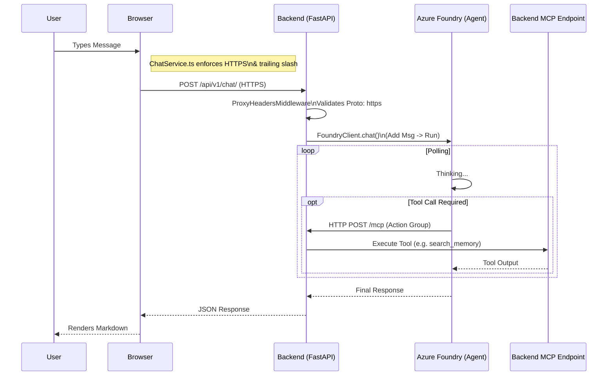

# Chat Architecture Refactor: Foundry-to-MCP & Strict HTTPS

**Date:** 2026-01-18
**Status:** Implemented

## 1. Overview

This document details the complete refactor of the Chat subsystem in **openContextGraph**. The goal was to align with the "Foundry First" architecture where Azure Foundry agents drive execution via server-side Action Groups (MCP), while enforcing strict enterprise-grade security (HTTPS) to resolve persistent "Mixed Content" errors.

## 2. The Architecture Shift

### Previous Flow (Problematic)

* **Mixed Logic:** `chat.py` contained mixed logic for local agents vs. Foundry agents.
* **Loose HTTP/S:** Frontend used relative paths or `VITE_API_URL` without strict enforcement.
* **Redirect Loop:** FastAPI running behind Azure Container Apps (ACA) Ingress (Envoy) did not trust `X-Forwarded-Proto`. It saw traffic as `http`, so when normalizing URLs (e.g., adding a slash), it issued `307 Redirect` to `http://...`, causing browser blockage.

### New Flow (Refactored)

* **Strict HTTPS:** Frontend explicitly forces `https://` and ensures trailing slashes to prevent redirects.
* **Trusting Proxy:** Backend explicitly trusts generic upstream proxies (`ProxyHeadersMiddleware`).
* **Dedicated Client:** New `FoundryClient` encapsulates Azure SDK logic.

## 3. Key Components

### 3.1 Frontend: Strict `ChatService`

Located in `frontend/src/services/ChatService.ts`.

* **Singleton Pattern:** Ensures consistent configuration.
* **HTTPS Enforcement:** Aggressively rewrites `http://api.ctxeco.com` to `https://`.
* **Trailing Slash:** Appends `/` to API calls (`/api/v1/chat/`) to bypass FastAPI's automatic redirect mechanism, which was downgrading requests to HTTP.

### 3.2 Backend: `FoundryClient`

Located in `backend/integrations/foundry.py`.

* **Encapsulation:** Wraps `openai.AzureOpenAI`.
* **Thread Management:** Handles Thread creation, Message injection (Context), and Run execution.
* **Polling:** Implements robust polling loop for `completed` or `requires_action` states.

### 3.3 Backend: Middleware Fix

Located in `backend/api/main.py`.

* **`ProxyHeadersMiddleware`**: configurd with `trusted_hosts="*"`.
* **Why:** Azure Container Apps terminates SSL at the ingress. The container receives HTTP. Without this middleware, FastAPI believes it is serving HTTP. When it generates a redirect (e.g. for a missing slash), it generates an HTTP Location header, breaking the security chain.

## 4. Implementation Details

### The "Mixed Content" Fix

The persistent error `Mixed Content: The page at 'https://...' was loaded over HTTPS, but requested an insecure resource` was traced to a **Double Fault**:

1. **Frontend URL Construction:** The client was requesting `/api/v1/chat` (no slash).
2. **FastAPI Behavior:** FastAPI strictly matched `/api/v1/chat/`. It decided to redirect the client to the correct URL.
3. **Proxy Unknown:** Because FastAPI didn't know it was behind a secure proxy, it constructed the redirect URL using the scheme it *saw* (HTTP).
4. **Browser Block:** The browser received `307 Redirect -> http://...` and blocked availability.

**Resolution:**

1. **Frontend:** `const url = ${this.apiBase}/api/v1/chat/;` (Added slash).
2. **Backend:** `app.add_middleware(ProxyHeadersMiddleware, trusted_hosts="*")`.

## 5. Deployment Verified

* **Commit:** `19de6ad` (includes Backend Import Fix)
* **Status:** Deployment in progress.

### 5.1 Final Fixes

After initial deployment, a 500 error revealed an import issue.

* **Corrected Import:** `from backend.integrations.foundry` instead of `from integrations.foundry`.
* **Package Init:** Added `backend/integrations/__init__.py`.
