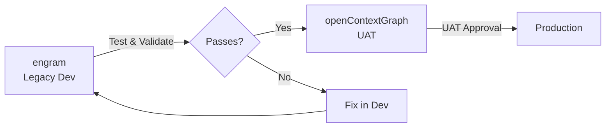

# Code Review Policy

*Last Updated: 2026-01-11*

This document outlines the code review requirements, security controls, and automated tooling for the openContextGraph (UAT) repository.

## Overview

All changes to the openContextGraph codebase require review before merging to `main`. This policy ensures:

- **Security**: Sensitive code paths receive appropriate scrutiny
- **Quality**: Automated checks catch common issues before review
- **Accountability**: All commits are signed (DCO) for auditability
- **Compliance**: NIST AI RMF alignment (GOVERN 1.1, MANAGE 4.1)

> [!IMPORTANT]
> openContextGraph is the **UAT environment**. All features should be tested in the dev environment (ctxEco dev) before promotion here.

## CODEOWNERS

The `.github/CODEOWNERS` file enforces automatic reviewer assignment based on file paths.

### Security Critical (Derek Required)

| Path | Reason |
|------|--------|
| `backend/api/middleware/auth.py` | Authentication/Authorization |
| `backend/core/` | Security context, 4-layer schema |
| `infra/` | Infrastructure as code |
| `.github/workflows/` | CI/CD pipelines |
| `.env*` | Secrets configuration |

### High Sensitivity (Derek Required)

| Path | Reason |
|------|--------|
| `backend/memory/` | Zep integration, user data |
| `backend/etl/` | Document ingestion, data classification |
| `backend/db/` | Database migrations |
| `backend/agents/` | AI agent behavior |

### Documentation (Review for Accuracy)

| Path | Reason |
|------|--------|
| `docs/security/` | Security documentation |
| `docs/00-strategy/` | Strategic decisions |

## Pre-Commit Hooks

Install pre-commit hooks to catch issues before committing:

```bash
pip install pre-commit
pre-commit install
```

### Enabled Hooks

| Hook | Purpose |
|------|---------|
| **Ruff** | Python linting and formatting |
| **ESLint** | TypeScript/JavaScript linting |
| **detect-secrets** | Prevent credential leaks |
| **bandit** | Python security scanning |
| **DCO check** | Ensure signed-off commits |
| **check-added-large-files** | Prevent >1MB files |
| **check-yaml/json** | Syntax validation |
| **detect-private-key** | Block key file commits |

### Running Manually

```bash
# Run on all files
pre-commit run --all-files

# Run specific hook
pre-commit run ruff --all-files
pre-commit run detect-secrets --all-files
```

## DCO Sign-Off

All commits must include a Developer Certificate of Origin sign-off:

```bash
# Use -s flag when committing
git commit -s -m "feat: Add new feature"

# Result:
# feat: Add new feature
#
# Signed-off-by: Your Name <your.email@example.com>
```

This is enforced by:

1. Pre-commit hook (local)
2. CI workflow (GitHub Actions)

## Risk Scoring

PRs are automatically scored for risk based on:

| Factor | Weight |
|--------|--------|
| Lines changed | Base score |
| File sensitivity | Multiplier (see CODEOWNERS) |
| AI-generated code | +15 points |
| Large change (>500 lines) | +10 points |

### Risk Levels

| Score | Level | Action Required |
|-------|-------|-----------------|
| 0-19 | ✅ LOW | Standard review |
| 20-39 | 📋 MEDIUM | Standard review |
| 40-69 | ⚠️ HIGH | Careful review, ensure tests |
| 70-100 | 🚨 CRITICAL | Senior engineer review, consider splitting |

### Running Risk Score

```bash
# Check staged changes
python scripts/risk_score.py --diff-only

# Check a PR
python scripts/risk_score.py --pr-number 123

# Output as JSON
python scripts/risk_score.py --diff-only --json
```

## CI/CD Workflow

The `.github/workflows/ci.yml` includes:

### On Pull Request

1. **DCO Check**: Verify all commits are signed
2. **Tests**: Run pytest with coverage
3. **Lint**: Ruff for Python
4. **Security Scan**: SBOM + vulnerability check

### Security Scanning

```yaml
security-scan:
  - Syft: Generate SBOM (SPDX format)
  - Grype: Vulnerability scanning
  - Fail on: HIGH/CRITICAL vulnerabilities
  - Upload: SARIF to GitHub Security tab
```

## Feature Flags

New features can be gated behind feature flags for safe rollout:

```python
from core.feature_flags import is_enabled, require_feature

# Check if feature is enabled
if is_enabled("new_feature"):
    # Use new code path
    pass

# Gate an endpoint
@router.get("/experimental")
@require_feature("experimental_endpoint")
async def experimental():
    ...
```

### Configuration Priority

1. Environment variables (`FEATURE_<FLAG_NAME>`)
2. Config file (`config/features.json`)
3. Default values

### Quick Disable

Set environment variable to disable a feature in production:

```bash
FEATURE_VOICE_ENABLED=false
```

## Audit Logging

All significant actions are logged for compliance:

```python
from core.audit import audit_log, AuditEventType

# Log an event
audit_log(
    AuditEventType.MEMORY_SEARCH,
    action="semantic_search",
    user_id=user.user_id,
    details={"query": query},
)

# Use decorator
@audited(AuditEventType.MEMORY_SEARCH)
async def search_memory(query: str, user_id: str):
    ...
```

### Event Types

| Category | Events |
|----------|--------|
| **Security** | auth.success, auth.failure, access_denied |
| **Agent** | agent.invoked, agent.tool_call, agent.error |
| **Memory** | memory.search, memory.add, memory.delete |
| **ETL** | etl.ingest_start, etl.classification |
| **Admin** | config_change, role_change |

## Rollback Procedures

If a deployment causes issues, use the rollback script:

```bash
# Check current status
./scripts/rollback.sh status

# Revert last git commit
./scripts/rollback.sh git HEAD~1

# Roll back Azure Container App
./scripts/rollback.sh container 5

# Roll back database migration
./scripts/rollback.sh db 001
```

## Promotion from Dev

Features should be promoted from the legacy dev repository (engram) after testing:



### Promotion Checklist

Before promoting code from legacy engram to openContextGraph:

- [ ] Feature fully tested in dev environment
- [ ] All pre-commit hooks pass
- [ ] Risk score acceptable
- [ ] No engram-specific branding
- [ ] Documentation updated
- [ ] Feature flag configured (if experimental)

## Review Checklist

Before approving a PR, verify:

- [ ] DCO sign-off present on all commits
- [ ] Pre-commit hooks pass
- [ ] Risk score is acceptable (or justified)
- [ ] Tests added for new functionality
- [ ] Security-sensitive changes have appropriate reviewers
- [ ] No hardcoded secrets or credentials
- [ ] Feature flags used for experimental features
- [ ] Audit logging added for new data access patterns
- [ ] No dev-only (engram) references

## NIST AI RMF Alignment

| Control | Implementation |
|---------|----------------|
| **GOVERN 1.1** | DCO, CODEOWNERS, review requirements |
| **GOVERN 1.2** | Audit logging, user attribution |
| **MANAGE 4.1** | Feature flags, rollback scripts |
| **MANAGE 4.2** | Comprehensive audit trail |
| **MEASURE 2.1** | Risk scoring, security scanning |

## Repository Structure

```
openContextGraph/
├── .github/
│   ├── CODEOWNERS          # Reviewer requirements
│   └── workflows/
│       └── ci.yml          # CI/CD pipeline
├── backend/
│   ├── agents/             # AI agents (Elena, Marcus, Sage)
│   ├── api/                # FastAPI routes
│   │   └── middleware/     # Auth middleware
│   ├── core/               # 4-layer context, audit, flags
│   ├── etl/                # Antigravity Router
│   └── memory/             # Zep Memory Client
├── config/
│   └── features.json       # Feature flags
├── docs/
│   └── security/           # Security documentation
├── scripts/
│   ├── risk_score.py       # PR risk scoring
│   └── rollback.sh         # Rollback procedures
└── .pre-commit-config.yaml # Pre-commit hooks
```

## Questions?

Contact: Derek Moore ([@derekbmoore](https://github.com/derekbmoore))
